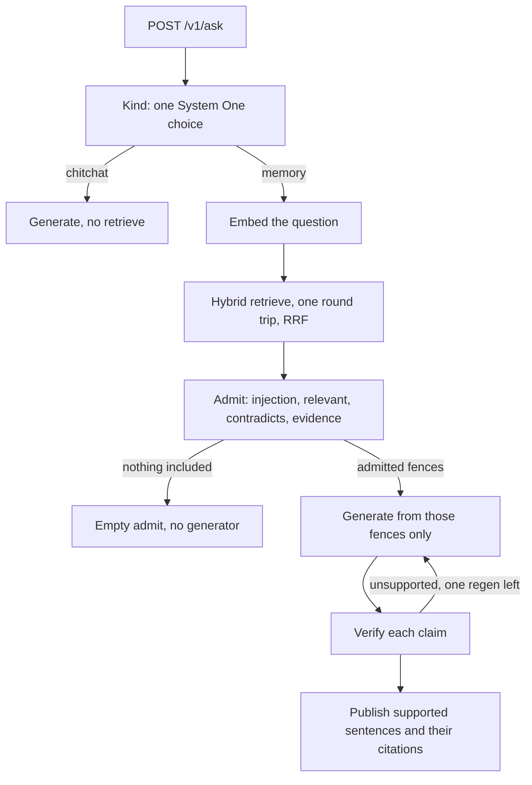
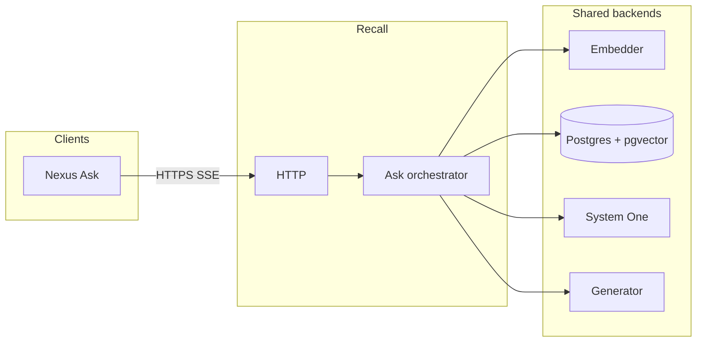

# Recall

Retrieve, admit, then generate. Recall sits beside Nexus and owns the ask path: hybrid search over a brain, citation admission, and a streamed answer. Nexus Ask is a client. It does not call the embedder, System One, or the generator.

Empty admission returns a fixed “I do not have that” and never calls the generator. A claim that verification does not support is stripped before anything is published.

Product contract: [`architecture.md`](architecture.md). Stage knobs: [`plan.md`](plan.md). Where they disagree on the ask pipeline, `plan.md` wins.

## Ask path



Open the interactive version in a browser: [`docs/ask-citations.html`](docs/ask-citations.html). Pan, zoom, switch theme, and trace each stage. Source spec: [`docs/ask-citations.workflow.json`](docs/ask-citations.workflow.json).

Memory asks emit `admitted`, then buffer generate and verify, then one `token`, `verified`, and `done`. Chitchat skips retrieve and verify and may stream tokens before `done`.

## Processes



The same map as a viewer: [`diagrams/recall-service.html`](diagrams/recall-service.html). Spec: [`diagrams/recall-service.architecture.json`](diagrams/recall-service.architecture.json).

Replicas are stateless. The index and the model servers are shared. Scale by adding Recall processes.

| Process | Role |
| --- | --- |
| `recall` | Axum HTTP. `POST /v1/ask` (SSE) and `POST /v1/ask/sync` (JSON). |
| Embedder | Same model Nexus indexed with. Query vectors are not produced locally. |
| Postgres | Corpus. Vector plus lexical search, fused with reciprocal rank fusion. |
| System One | Kind, admission filters, and claim verification. Local image is Laya; the wire matches hosted Jev. See [`services/systemone/README.md`](services/systemone/README.md). |
| Generator | OpenAI-compatible chat completions. Local stack runs llama.cpp. |
| `recall-dash` | TUI over the JSON log line (`scripts/dev.sh` tees `/tmp/recall.jsonl`). |

## Run locally

```bash
cp .env.example .env   # set OPENAI_API_KEY or EMBEDDER_API_KEY, and RECALL_SERVICE_TOKEN
CONTAINERS_MACHINE_PROVIDER=libkrun podman compose up
```

Compose brings up Postgres (`localhost:5433`), System One (`:8082`), the generator (`:8080`), and Recall (`:8000`). Model weights stay on the host (`MODELS_HOST_PATH`, `HF_CACHE_HOST_PATH`).

Host binary against that corpus, or read-only against Nexus:

```bash
scripts/dev.sh local    # migrations and index writes on
scripts/dev.sh nexus    # recall_search only; no writes
```

`scripts/e2e.sh` checks a cited answer, an empty admit, and the audit row. `scripts/seed.py` loads the local corpus. Rank notes: [`docs/rank_baseline.md`](docs/rank_baseline.md).

`GET /healthz` is liveness. `GET /readyz` checks embedder, index, System One, and generator. Everything under `/v1` needs `Authorization: Bearer <RECALL_SERVICE_TOKEN>`.

Index writes (`PUT` / `DELETE /v1/index/chunks/{id}`) exist only when `INDEX_WRITES_ENABLED=true`. Against Nexus they stay off.
