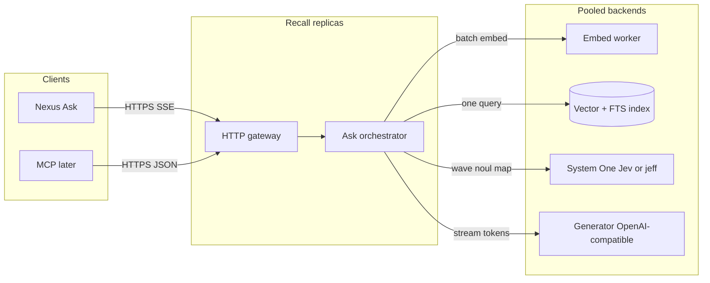

# Recall — retrieve, admit, generate

Ask-path stages and knobs are specified in `plan.md`. This document is the product
contract (empty admit, no unfiltered RAG, SSE events, index invariants). Where they
conflict on the ask pipeline, `plan.md` wins.

A service beside Nexus. Nexus Ask becomes a thin client. Recall owns retrieval, citation admission, and the streamed answer.

Nexus does not call Jev, the embedder, or the generator.

## Goal

Concurrent user asks. One ask never loops the classifier per memory. Empty admission returns “I do not have that” without a generator call.

## Pipeline

```
POST /v1/ask
  → embed question          (shared embed worker, dynamic batch)
  → hybrid retrieve         (vector + lexical, one round trip)
  → admit citations         (one System One call per wave, waves in parallel under a cap)
  → stream generate         (only admitted fences)  OR  empty-admit JSON
```

Embed is an embedding model, not a chat LLM.

## Process view



Replicas are stateless. Index and model servers are shared. Horizontal scale is more Recall processes, not threads inside one ask.

## Concurrency rules

1. **Many asks at once.** Each replica uses async IO. No thread blocked on GPU or HTTP.
2. **One ask, one retrieve.** No N+1 SQL.
3. **Admission is batched.** One System One `POST /v1/systemone` carries the question plus a wave of candidates. Each candidate is a `noul` question. Jev answers the map in one parallel sample.
4. **Waves, not a serial loop.** If candidates exceed the state budget (~64k tokens for hosted Jev) or a configured `admit_wave_size` (default 16), split into waves. Run up to `admit_concurrency` (default 4) waves at once. Merge scores. Never 50 serial calls.
5. **Embed micro-batch.** Concurrent asks that land in the same 8–16 ms window share one embed forward pass.
6. **Backpressure.** If in-flight asks on a replica exceed `max_inflight`, return `503` with `Retry-After`. Do not queue streams for seconds.
7. **Generator is one stream per ask.** Prefill starts only after admission. Empty admission skips the generator.

## Limits (v0)

| Knob | Default | Why |
| --- | --- | --- |
| `retrieve_k` | 32 | Generous candidate set |
| `admit_wave_size` | 16 | Fits System One state |
| `admit_concurrency` | 4 | Cap classifier QPS per ask |
| `admit_threshold` | 0.7 noul | Calibrate on eval, not gut |
| `max_citations` | 4 | Generator context |
| `max_inflight` per replica | 32 | Tail latency |
| `embed_batch_wait_ms` | 8 | GPU utilization |
| Ask timeout | 60 s | Stream abort |

## Endpoints

Base: `https://recall.<env>/v1`. Auth: `Authorization: Bearer <service token>` issued to Nexus. No end-user JWT inside Recall.

### `GET /healthz`

Liveness. No dependency checks. `200 { "ok": true }`.

### `GET /readyz`

Readiness. Checks embed worker, index, System One, generator with short timeouts. `200` when all pass. `503` otherwise.

```json
{
  "ok": true,
  "embed_ms": 12,
  "index_ms": 4,
  "system_one_ms": 80,
  "generator": "configured"
}
```

### `POST /v1/ask`

Streaming ask. SSE. This is the product path.

**Request**

```json
{
  "question": "string, 1–4000 chars",
  "as_of": "2026-09-21T18:00:00Z",
  "brain_id": "uuid",
  "trace_id": "uuid"
}
```

Optional later: `scope` (personal | org mount). v0: Recall reads only the index slice for `brain_id` plus already-materialized mount docs.

**Response** `text/event-stream`

| Event | Data |
| --- | --- |
| `stage` | `{ "stage": "...", "status": "started" \| "ok" \| "failed", "ms": n? }` |
| `admitted` | `{ "citations": [Citation], "candidate_count": n }` — provenance (id, origin, grantor, source, timestamps) lives on each citation object |
| `empty` | `{ "reason": "no_admitted_citation" \| "no_verified_claim" }` |
| `token` | `{ "text": "..." }` — verified published text only (memory asks; one event) |
| `verified` | `{ "claims": [ClaimVerdict] }` |
| `done` | `{ "ask_id": "uuid", "text": "...", "citations": [Citation], "empty": bool, "usage": { ... } }` |
| `error` | `{ "code": "...", "message": "..." }` |

Memory asks: `admitted` → (buffer generate + verify) → `token` → `verified` → `done`.
Chitchat skips retrieve and verify; tokens may stream live before `done`.

`Citation`:

```json
{
  "id": "uuid",
  "index": 0,
  "statement": "string",
  "noul": 0.91,
  "origin": "personal | granted",
  "grantor_name": "string | null"
}
```

If `empty`, Nexus shows Circadian copy: “I do not have that.” No generator tokens.

### `POST /v1/ask/sync`

Same body as `/v1/ask`. JSON for tests and MCP. No SSE.

**Response** `200`

```json
{
  "ask_id": "uuid",
  "text": "string",
  "citations": ["Citation"],
  "empty": false,
  "usage": {}
}
```

Empty admit: `text` is the fixed refusal string, `empty: true`, `citations: []`.

### `GET /v1/asks/{ask_id}`

Audit. Admission log for eval. Not a user surface.

```json
{
  "ask_id": "uuid",
  "question": "string",
  "candidates": [{ "id": "uuid", "noul": 0.12, "admitted": false }],
  "admitted_ids": ["uuid"],
  "empty": false
}
```

### Index (Recall-owned corpus)

Nexus pipeline writes here. Not on the Ask hot path from the browser.

| Method | Path | Role |
| --- | --- | --- |
| `PUT` | `/v1/index/chunks/{id}` | Upsert chunk + embedding + lexical text + brain_id + origin |
| `DELETE` | `/v1/index/chunks/{id}` | Remove |
| `POST` | `/v1/index/embed` | Embed texts for the writer (optional; writer may embed itself) |

`PUT` body:

```json
{
  "brain_id": "uuid",
  "text": "string",
  "statement": "string",
  "embedding": [0.0],
  "origin": "personal | granted",
  "grantor_brain_id": "uuid | null",
  "grantor_name": "string | null",
  "sensitivity": "normal | sensitive",
  "valid_from": "iso | null",
  "valid_to": "iso | null",
  "state": "active"
}
```

Reject `secret`. Reject `pending`. Same invariants as Nexus mount.

v0 may skip these and let Recall query Nexus Postgres with a restricted role. Prefer a Recall-owned index once Ask is cut over, so Nexus and Recall do not share a request pool.

## Admission call shape

One wave, one HTTP call to System One (`POST {SYSTEM_ONE_BASE}/v1/systemone`).

`state` is structured:

```json
{
  "question": "…",
  "as_of": "…",
  "candidates": [
    { "id": "m0", "origin": "granted", "grantor": "Pepe", "text": "…" }
  ]
}
```

`questions` is a map, one `noul` per candidate:

```json
{
  "m0": {
    "type": "noul",
    "instructions": "This candidate is sufficient evidence to answer the question. It is not merely on a related topic."
  }
}
```

Admit if `noul >= admit_threshold`. Sort by noul descending. Keep `max_citations`. If none pass, empty admit.

Do not use `choice` over all memories as the only gate. High cardinality plus “pick one” hides multiple valid citations.

## Generator

OpenAI-compatible `POST /v1/chat/completions` with `stream: true`. Prompt: system twin instructions + fenced admitted citations only + question. The prompt still asks for `[memory_N]` and a short quote.

A small local model (Qwen 2.5 1.5B) paraphrases the admitted text and omits both. That does not drop the citations. Verify binds an uncited sentence to the admitted memory it overlaps and checks that pair with relate. `done.citations` and the sync `citations` array include those objects either way. The published sentence does not have to contain the marker. A claim that matches no admitted memory, or that relate does not support, is stripped; if nothing remains, the payload is the empty-admit refusal and `citations` is empty.

Local or hosted. Recall sets `base_url` and `model` from env.

## Failure behavior

| Failure | Ask behavior |
| --- | --- |
| Embed timeout | `error` event, 504 on sync |
| Index timeout | same |
| System One timeout / 5xx | retry once on that wave; if still fail, do not fall back to “dump all candidates” into the generator |
| Generator stream drop | `error` after any tokens already sent |
| Empty admit | `empty` event, no generator |

No silent fallback to unfiltered RAG. That would undo the product.

## Deployment

| Process | Scale unit | Notes |
| --- | --- | --- |
| Recall HTTP | N replicas behind a load balancer | Sticky sessions not required (SSE is one request) |
| Embed worker | 1–N GPU or CPU | Dynamic batch; separate from HTTP so a slow batch does not stall health |
| System One | Hosted Jev or jeff/edgejev replica | HTTP/2 pool from Recall |
| Generator | vLLM / llama.cpp / API | Stream; concurrent sequences |
| Index | Postgres+pgvector or Qdrant + FTS | Connection pool ≥ `max_inflight` × replicas |

SSE idle timeouts: load balancer 120 s. Recall sends a comment ping every 15 s until first token if admission is slow.

## What Nexus changes later (not this service)

- `POST /api/ask` proxies to Recall SSE and forwards `X-Nexus-Citations` from the `admitted` event.
- Library / pipeline optionally `PUT`s chunks to `/v1/index/chunks/{id}`.
- No Jev keys in the Next app.

## v0 out of scope

- User-facing auth inside Recall
- Org mount logic (Nexus materializes granted chunks into the index)
- Replacing extract / digest / OCR models
- Multi-tenant billing
