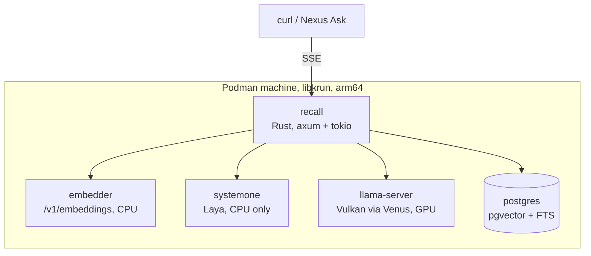
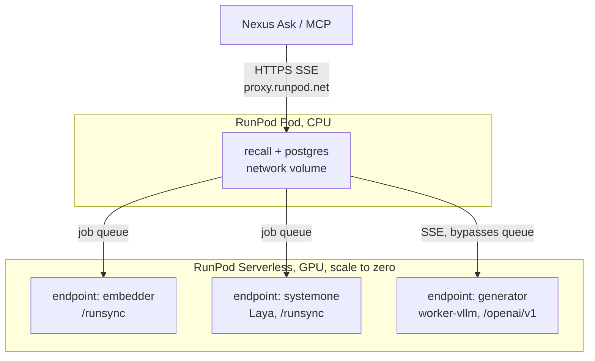

# Recall — build plan

Plan for the service described in `architecture.md`.

Decided: Rust for the service, Laya behind the System One protocol, pull-based workers
claiming jobs from a queue, and two environments — local OrbStack containers on CPU for
development, RunPod GPU for real deployment.

Seven research findings change the architecture before any code is written. Three delete
work, one adds a blocking deliverable, and three add requirements the document does not
currently account for. Findings 6 and 7 cover the worker-queue model and what it does to
the marker-type pipeline pattern.

## Finding 1 — Neither environment is the one architecture.md assumes

`architecture.md` describes N stateless replicas behind a load balancer with shared model
servers. Neither environment looks like that, and they do not look like each other.

**Local: GPU works, on Podman with libkrun — measured, not assumed.** OrbStack cannot do
this. Apple's `Virtualization.framework` does not expose the host GPU to a Linux guest, and
OrbStack's own tracker ([orbstack#1818](https://github.com/orbstack/orbstack/issues/1818))
confirms there is no path to one. Podman reaches the GPU through `libkrun` on
Hypervisor.framework, which forwards Vulkan out of the guest: Mesa Venus → virglrenderer →
MoltenVK → Metal. **This environment is now set up and verified** — see
*Local GPU: measured* below. Local development therefore moves from OrbStack to Podman.

The catch is that only engines with a Vulkan backend benefit. llama.cpp has `ggml-vulkan`,
so the generator is accelerated. Laya is a ModernBERT encoder with a decision head on
PyTorch, whose Vulkan backend is unmaintained and superseded by ExecuTorch's Android-focused
delegate, and ONNX Runtime has no Vulkan provider either. **So admission stays CPU-bound
locally**, and the local bottleneck moves from the generator to the classifier.

**RunPod: GPU, but no Compose.** Docker Compose is explicitly unsupported; Runpod manages
Docker itself and each Pod runs exactly one container. So the local four-service Compose
file does not deploy. Multi-service on RunPod means either several Pods wired together
over Global Networking, or one fat image with a supervisor.

The consequence that matters most for sequencing: **Phase 0's measurements do not set
production knobs.** Local numbers come off CPU containers on arm64; production numbers
come off CUDA containers on amd64. Every latency knob gets set twice. What *does* transfer
is the calibrated admission threshold, because that is a property of the model and its
fitted temperature, not of the hardware — so the expensive Phase 4 labeling work is not
wasted by the move.

Locally this means small models and slow tokens, which is fine for correctness and
plumbing. Nothing in the design should bend to make CPU generation fast, because CPU
generation is not the target.

## Finding 2 — Jev cannot be self-hosted, so "System One" means a different model

Jev is a closed hosted model. Weights, parameter count, architecture and the RLCD
training recipe are all unpublished, and there is no self-hosted or VPC option. What is
public is the wire protocol: `POST /v1/systemone` taking `state` plus a map of typed
questions, returning `noul` / `choice` / `score`.

That is good news for `architecture.md`: the *Admission call shape* section survives
unchanged. We keep the protocol and swap the model behind it, so `SYSTEM_ONE_BASE` is the
only thing that moves.

**Decided: Laya** (`NandhaKishorM/laya`) — a typed-decision head on a frozen
ModernBERT-large, 421M, Apache-2.0. It is the option whose weights we control and the only
one publishing calibration numbers. It runs on CPU at 193–464 ms per question, which makes
local development viable without a GPU, and on a GPU it drops to roughly 33–40 ms on
T4-class hardware. Node and Rust community ports exist if we ever want it in-process.

Two things to keep on the shelf rather than adopt now: `edgejev`, an ONNX int8 packaging
that claims 15.6 ms per question on 4 vCPU with no torch dependency, worth benchmarking in
Phase 4 once quality is settled; and `khimaros/verdict`, a shim that turns any
`llama-server` into a `/v1/systemone` endpoint, useful only if we later want admission to
reuse the generator's weights.

## Finding 3 — Self-hosting deletes the wave machinery

`architecture.md` rules 3 and 4, and the `admit_wave_size` / `admit_concurrency` knobs,
exist to work around two properties of a hosted Jev: a per-call price and a ~64k token
state budget. Neither applies to a model we run.

Laya scores each `(question, candidate)` pair independently, and those batch into one
forward pass group. So the whole wave design collapses to:

> one batched scoring request covering all `retrieve_k` candidates.

No wave splitting, no `admit_concurrency` semaphore, no score merging across waves, no
state-budget arithmetic. That removes the most intricate concurrency in the design and a
class of bugs with it. Batching becomes the scorer's internal concern, configured once as
`admit_batch_size`.

The substance of rule 3 survives and gets stronger: admission is still one call per ask,
and still a per-candidate `noul` rather than a `choice` over all memories.

## Finding 4 — Calibration is blocking, not a nice-to-have

`architecture.md` sets `admit_threshold` to `0.7 noul` and notes "calibrate on eval, not
gut". That note needs promoting to a hard gate, because every open scorer is badly
calibrated as shipped:

- Laya reports expected calibration error of **0.466 as shipped**, falling to **0.081**
  after temperature fitting. Untuned, a 0.7 cutoff is arbitrary.
- Cross-encoder relevance scores are known to pile up near zero, so a fixed global
  threshold silently admits nothing or everything.
- Projects that skip temperature fitting explicitly disclaim that their numbers are
  probabilities of correctness.

So `admit_threshold` is not a number we pick now. It is the **output of Phase 4**, fit on
a labeled set, with a precision/recall curve checked in beside it.

**Now confirmed on our own stack, with numbers.** Running the built service against the
70-chunk seed corpus, the top noul for a question the corpus *can* answer:

| Question | top noul | 2nd | 3rd | 4th |
| --- | --- | --- | --- | --- |
| "When is my sister Ana's birthday?" | **0.218** | 0.158 | 0.094 | 0.066 |
| "What am I allergic to?" | **0.648** | 0.305 | 0.219 | 0.215 |
| "What is the wifi password at the cabin?" | **0.688** | 0.667 | 0.501 | 0.412 |

Two things follow. First, `architecture.md`'s 0.7 would refuse all three — including
questions whose exact answer sits at rank 1. Second, and worse for the idea of a global
cutoff, the *correct* answer to the first question scores lower than the *third-best*
candidate for the third. Retrieval and ranking are fine: the right chunk ranks first every
time and the generator answers correctly from it. The number itself is the problem.

The working default is now `0.15`, which is measured, not fitted, and it has a visible
precision cost: at that level "Maya's birthday is December 5" is admitted alongside Ana's.
Laya's own loader says the same thing out loud at startup — *"this checkpoint ships
temperatures outside [0.5, 5] which would distort confidence … treat confidence from the
affected buckets as uncalibrated."*

This strengthens the Phase 4 brief: temperature fitting alone may not be enough, and the
fallback the literature points to is per-query normalisation — rank or margin within a
single ask's candidate set rather than one global cutoff.

One more thing the literature backs, and it is why the admission stage exists at all:
semantic similarity is not the same as containing the answer. Retrieval reliably returns
passages that look right and do not answer the question. Admission is the stage that
catches that, which is why *"no silent fallback to unfiltered RAG"* is the load-bearing
product rule in `architecture.md`.

## Finding 5 — RunPod's ingress will break SSE unless the service is written for it

Recall's product path is a long-lived `text/event-stream`. RunPod Pod HTTP ports are
published at `https://<pod-id>-<port>.proxy.runpod.net`, and that route runs through
Cloudflare. Three properties of it are load-bearing:

1. **Responses get buffered.** The standard fix, which RunPod uses on its own log-streaming
   API, is to send `X-Accel-Buffering: no` alongside `Cache-Control: no-cache` and
   `Connection: keep-alive`. Axum does not do this by default, so it is explicit code in
   the SSE handler, not configuration.
2. **100-second cap, returning `524`.** A connection that has not started streaming within
   100 seconds is closed. Once bytes flow, the stream stays open. This makes the
   progress events in the next section a *correctness* requirement rather than a nicety:
   slow admission with no output is a dropped connection. It also corrects
   `architecture.md`, which assumes a 120-second load-balancer idle timeout we do not get
   to choose.
3. **Bind `0.0.0.0`.** The proxy cannot reach a service on `127.0.0.1`.

If buffering turns out to be undefeatable, the fallback is exposing a TCP port instead of
an HTTP one, which means no automatic TLS, an external port that differs from the internal
one and changes on every Pod reset, and reading it at runtime from `$RUNPOD_TCP_PORT_*`.
Worth knowing, worth avoiding.

## Finding 6 — The pull-based worker queue already exists; it is RunPod Serverless

The intent is that the embedder, classifier and generator poll a queue and claim jobs
rather than being called directly. That is the right instinct on this platform, and for
better reasons than concurrency: pull-based workers need **no inbound addressability**,
which sidesteps Global Networking's same-region constraint, Community Cloud IP churn, and
exposing model servers publicly. It also allows scale-to-zero.

RunPod Serverless is exactly that model, already built. An endpoint is a queue; workers
pull jobs from it and are autoscaled; `POST /run` enqueues, `GET /status/{id}` collects,
`GET /stream/{id}` drains incremental output, and `/cancel`, `/retry` and `/purge-queue`
round out the queue operations. There is an official maintained `worker-vllm` image for
the generator.

So the question is not whether to use a claim-based queue but **who owns it**:

| | RunPod owns the queue (Serverless) | Recall owns the queue (Postgres) |
| --- | --- | --- |
| Queue code to write | none | claim, lease expiry, redelivery, DLQ, worker loop ×3 |
| Addressability | workers need no inbound port | same |
| Scale to zero | built in | build it |
| Cold start on a waiting ask | **the main risk**, see below | avoidable by keeping workers warm |
| Portability | coupled to RunPod | runs anywhere |

Recommended: **RunPod owns the queue.** The custom alternative is a few thousand lines of
distributed-systems code whose main benefits RunPod already provides, and the one advantage
it has — cold-start control — is also purchasable by setting a minimum worker count.

If we do build our own later, the lazy correct substrate is already in the plan:
`SELECT … FOR UPDATE SKIP LOCKED` on the Postgres we are running anyway, with
`LISTEN`/`NOTIFY` for wakeup so workers do not poll on an interval. No Redis, no Kafka.

Two consequences that shape the code:

**The generator must bypass the queue.** `/stream/{job_id}` is poll-based — each call drains
chunks buffered since the last — so relaying it into an SSE response means Recall polls in a
loop and forwards, adding latency per chunk. `worker-vllm` instead exposes
`/openai/v1/chat/completions`, which streams real SSE and bypasses the job queue. Using it
keeps the generator contract in `architecture.md` literally unchanged. Embed and admit are
request/response and fit the queue perfectly; only generation needs the escape hatch.

**Cold start collides with the ask budget.** RunPod's own docs note the first call after idle
can exceed `/runsync`'s 60-second limit, because it pays image pull plus model load. That
blows both the 60-second ask timeout and Cloudflare's 100-second cap. Scale-to-zero and a
user waiting on an SSE stream are in direct conflict, and the resolution is a cost decision,
not a code one. See *Open decisions*.

## Finding 7 — There are two pipelines, and they want opposite architectures

`architecture.md` already draws this line — the index write path is *"not on the Ask hot path
from the browser"* — but the consequences deserve to be explicit, because the queue, retry
and marker-type machinery fits one and fights the other.

| | **Ask pipeline** | **Ingest pipeline** |
| --- | --- | --- |
| Trigger | user waiting on SSE | `PUT /v1/index/chunks/{id}` |
| Budget | 60 s hard, Cloudflare 100 s | minutes to hours |
| On failure | `error` event, user retries | retry, then dead-letter |
| Retry owner | one retry, in-process | the queue |
| DLQ | **none — nobody reprocesses a dead ask** | yes, with chain-depth counter |
| State across processes | no, one continuous call | yes, serialized between stages |
| Marker types | viable | counterproductive, see below |

The bounded-channel backpressure, per-stage `FailFast`/`Continue`/`DeadLetter` policy, and
dead-letter queue with a chain-depth counter all belong to **ingest**. On the ask path they
are answering questions nobody asked: there is no downstream consumer to protect with
backpressure beyond `max_inflight`, and no point dead-lettering a request whose caller has
already been shown an error.

## Marker types: right pattern, wrong layer for this design

The synthesis in the pasted research is sound, and points 1, 3 and 5 hold regardless —
types encode phase and not retry state, retries wrap effects and not transitions, and one
error type with a transient/permanent split should feed both the retry predicate and the
failure decision. Point 2 is the sharpest observation in it: a by-value transition loses
the state on error, so `Result<Job<Loaded>, (Self, StageError)>` is the shape that lets a
caller recover.

The decisive question is **where the queue boundary falls relative to the stages**, and the
answer differs by pipeline.

**Ask path, with RunPod owning the queue.** The boundary lands *inside* a stage: `admit`
submits a job and awaits its result, but the `Ask` itself never leaves Recall's process. The
call chain stays continuous, so typestate's guarantee would genuinely hold here. It is
viable — it is just not worth its price. The pipeline is one linear function with one branch,
and typestate would thread a generic parameter through every signature to protect it. The
`AdmittedCitations` newtype below buys the same invariant for six lines.

**Anything where state crosses between stages.** This is where the pattern actively backfires,
and it covers both the ingest pipeline and the Option B design where Recall owns per-stage
queues. Typestate proves ordering within a call chain that owns the value; a claim-based queue
serializes the job to a row and reconstitutes it later, possibly in another process.
`PhantomData<S>` serializes to nothing, so on reconstitution you read a `stage` column and
dispatch on it to decide which `Job<S>` to build — precisely the runtime validation typestate
was meant to eliminate. You maintain a `stage` enum *and* a set of markers, paying for both
mechanisms and getting the guarantee of one.

Two smaller frictions point the same way there. A queue table and a worker loop are
homogeneous, but `Job<Validated>` and `Job<Embedded>` are distinct types, so holding them
together needs an enum wrapper or `Box<dyn>` — and once the enum exists it *is* the state
machine and the markers are decoration. And the "hand the state back on failure" shape is
already provided by the queue: an expiring lease redelivers the job, so the worker just
declines to ack.

So: not a verdict on the pattern, but on its leverage here. Marker types are worth reaching
for the moment a pipeline grows a second branch or a conditional stage, and worth skipping
while it is a straight line.

### What to do instead

Track stage at runtime, because the database needs it anyway — it is what
`GET /v1/asks/{ask_id}` returns and what `ProgressSink` already writes. One source of truth,
already in the plan.

Then protect the one invariant that actually matters with one newtype rather than a generic
parameter threaded through every signature:

```rust
/// Non-empty by construction. `generate` cannot be called without admitted evidence,
/// because there is no other way to obtain this type.
pub struct AdmittedCitations(Vec<Citation>);

impl AdmittedCitations {
    pub fn new(c: Vec<Citation>) -> Option<Self> {
        (!c.is_empty()).then(|| Self(c))
    }
}

async fn generate(ctx: &Ctx, ask: &Ask, admitted: AdmittedCitations) -> Result<Stream>;
```

That makes "generate without admission" unrepresentable — the actual product rule from
`architecture.md` — for six lines and no generics. Everything else typestate would have
guarded is ordering that the single code path in `pipeline::run` already makes unreachable.

## Retries, corrected for the queue model

The research's "choose the layer deliberately" is the operative rule, and with a queue the
queue is that layer:

- **Do not retry inside a worker while holding a claim.** Sleeping through a backoff on a
  live lease risks the lease expiring mid-sleep and the job being redelivered underneath you,
  running it twice. Decline the ack and let redelivery handle it.
- **`backon`, confirmed.** The `backoff` crate is unmaintained and carries
  [RUSTSEC-2025-0012](https://rustsec.org/advisories/RUSTSEC-2025-0012), which explicitly
  recommends migrating to `backon` (v1.6.0, actively maintained). Use it narrowly — two
  attempts with a short cap for transient blips against an already-warm endpoint, not as the
  primary retry mechanism.
- **At-least-once delivery means stages must be idempotent.** Embed and admit are pure
  functions of their input, so they are safe to run twice. **Generation is not**: retrying
  after tokens have reached the client is user-visible, which is why `architecture.md`
  specifies `error` after any tokens already sent. Generation is marked no-retry once the
  first token ships, and that is the one place the idempotency rule has real teeth.
- **Retry once on the scorer, never fall back.** Unchanged from `architecture.md`, and worth
  restating because it is the rule a generic retry/DLQ policy would quietly violate: an
  exhausted admission must produce an error or an empty admit, never a dump of unfiltered
  candidates into the generator.

## Environments

### Local GPU: measured

Benchmarked on this machine (M3 Max, 14 cores, 36 GB) inside a Podman/libkrun container,
Qwen2.5-1.5B Q4_K_M, `llama-bench -p 512 -n 128`:

| | GPU (Venus) | CPU | Speedup |
| --- | --- | --- | --- |
| Prefill, `pp512` | **1716.8 tok/s** | 124.8 tok/s | **13.8×** |
| Generation, `tg128` | **53.7 tok/s** | 26.0 tok/s | 2.1× |

The asymmetry is the important part, and it lands squarely on Recall's generator workload.
Our prompt is system instructions plus up to four fenced citations plus the question — heavy
on prefill, light on output. So the number that matters is the 13.8× on prefill, not the
2.1× on generation. Scaled to a realistic 7–8B model and a ~2000-token citation prompt, CPU
prefill alone would run 60–80 seconds and blow both the ask timeout and Cloudflare's
100-second cap; on GPU it is a few seconds. **Locally the GPU is not a nicety, it is what
makes the ask path fit its budget** — and it corrects my earlier assumption that CPU
generation would merely be "slow but fine".

Two gotchas worth writing down, because both fail silently:

1. **Homebrew-core's `virglrenderer` shadows the tap's.** Installing `krunkit` pulls
   `virglrenderer` from homebrew-core, which is built OpenGL-only — no Venus symbols, no
   MoltenVK linkage. Everything appears to work, `/dev/dri/renderD128` shows up in the
   guest, and Vulkan silently enumerates `llvmpipe` (CPU). The guest kernel gives it away:
   `dmesg` reports the Venus capset, id 4, with `max-version 0, max-size 0`. Fix:
   `brew uninstall --ignore-dependencies virglrenderer && brew install slp/krun/virglrenderer`,
   which is the `-Dvenus=true` build that depends on `molten-vk`.
2. **`krunkit` dies when its parent process exits.** `podman machine start` returns success
   and then the VM is reaped. It needs a long-lived parent; there is a LaunchAgent at
   `~/Library/LaunchAgents/dev.recall.podman.plist` that starts the machine and holds it open.

Verify with one command — it must say `venus`, not `llvmpipe`:

```sh
podman run --rm --device /dev/dri --entrypoint /bin/sh \
  quay.io/slopezpa/fedora-vgpu-llama -c 'vulkaninfo --summary | grep driverName'
```

Note that `quay.io/slopezpa/fedora-vgpu-llama` pins a June 2025 llama.cpp (build `b5622`),
so it cannot load model architectures added since. It is fine for verification and
benchmarking; for real use, build `unsuman/fedora-vgpu-llama` or a current Vulkan image.

### Local — Podman + libkrun, GPU for llama.cpp, CPU for Laya



One `compose.yaml`, five services, service-name DNS — `podman compose` reads the same file
Docker would. The generator container needs `--device /dev/dri` to reach the GPU; nothing
else does, since Laya and the embedder have no Vulkan path.

This is now a reasonably faithful development environment rather than a slow imitation: the
generator runs on the same GPU-accelerated llama.cpp it will use in production, so the
streaming and prefill behaviour we tune here should transfer. Admission is the one stage
that stays materially slower than production.

### Production — RunPod Serverless for the models, one Pod for Recall

See Finding 6: the pull-based worker queue is a RunPod Serverless endpoint, so we do not
build one.



Recall stays a Pod because it holds Postgres and a long-lived public HTTP port. The three
model services become Serverless endpoints, where RunPod's own queue does the job
distribution and its workers do the claiming.

Two operational consequences to plan for rather than discover:

- **Model weights need a network volume.** Otherwise every cold start re-pulls them from
  Hugging Face, and cold start is already the main risk on this path.
- **Postgres on RunPod is the weak point.** Pods reset, and Community Cloud IPs move.
  A network volume plus scheduled `pg_dump` is the minimum. See *Open decisions*.

If we later want the model services as always-on Pods instead, they talk to Recall over
Global Networking private hostnames (`*.runpod.internal`), which requires **all Pods in one
region** and exposes no public ports. That is the fallback if Serverless cold starts prove
intolerable.

### Images

The Rust service builds multi-arch (`linux/amd64` for RunPod, `linux/arm64` for local) with
one `docker buildx` invocation. The model services do not: local uses CPU images, production
uses CUDA images. Same protocol on both sides, different tags, selected per environment.

### Index: Postgres + pgvector, not Qdrant

`architecture.md` leaves this open. Postgres wins for a reason already in the document:
*"one ask, one retrieve"* and *"hybrid retrieve (vector + lexical, one round trip)"*.
Postgres does vector search and full-text search in the same engine, so hybrid retrieval is
genuinely one query — two CTEs fused with reciprocal rank fusion. Qdrant would mean a
second system, a second client, no real FTS, and fusion in application code. Image:
`pgvector/pgvector:pg17`.

Recall owns this database. `architecture.md` floats a v0 that queries Nexus Postgres
through a restricted role; there is no Nexus in either environment, and owning it from the
start is less work than migrating later.

## The Rust service

Rust holds up well here. Every model sits behind HTTP, so Rust's thin ML ecosystem never
comes up — the service is IO-bound orchestration with one fan-in and one streaming
fan-out, which is what `tokio` and `axum` are for. The type system also carries the
product's central invariant, that nothing reaches the generator without passing admission.

The honest cost: the hybrid-retrieval SQL, the SSE relay from the generator, and the
readiness probes are hand-written. A few hundred lines, not a project risk.

### Crates

`axum` (HTTP, SSE), `tokio`, `tower-http` (timeout, trace layers), `reqwest` (pooled
HTTP/2 to the three model services), `sqlx` with `pgvector`, `serde`, `tracing` +
`tracing-subscriber`. Nothing else until something hurts.

### Pipeline shape

The pipeline is linear with five fixed stages, so it needs no framework. A sequence of
`async fn`s over a state struct that moves from one to the next *is* the pipeline, and it
reads like the diagram.

```rust
// src/pipeline/mod.rs
pub enum Stage { Embed, Retrieve, Admit, Generate, Done }

pub async fn run(ctx: &Ctx, req: AskRequest, tx: &ProgressSink) -> Result<Ask> {
    let ask = Ask::new(req);
    let ask = tx.track(Stage::Embed,    embed(ctx, ask)).await?;
    let ask = tx.track(Stage::Retrieve, retrieve(ctx, ask)).await?;
    let ask = tx.track(Stage::Admit,    admit(ctx, ask)).await?;

    // The one branch that matters. AdmittedCitations cannot be constructed empty,
    // so there is no way to call generate without evidence.
    match AdmittedCitations::new(ask.admitted.clone()) {
        None => Ok(ask.into_empty_admit()),
        Some(cites) => tx.track(Stage::Generate, generate(ctx, ask, cites)).await,
    }
}
```

Each stage is one file — `embed.rs`, `retrieve.rs`, `admit.rs`, `generate.rs` — taking
`Ask` and returning `Ask`. No trait-object `Stage` abstraction, no DAG executor, no
channels between stages: the stage list is fixed at compile time, and abstracting over a
straight line only buys indirection. If the order ever becomes data-driven, that is when
to abstract it.

The `embed` and `admit` stages await queue-backed workers rather than calling a server
directly, but the `Ask` never leaves this process — which is why the stage enum here is
runtime data and not a marker type. See *Marker types* above for the reasoning.

### How progress gets tracked

One mechanism, three consumers. `ProgressSink::track` wraps each stage and records its
outcome and duration:

1. **Client** — a `stage` SSE event per transition. Per Finding 5 this is what keeps the
   Cloudflare connection alive through a slow admission, so it replaces the 15-second
   comment ping in `architecture.md` with something a client can also display.
2. **Operator** — a `tracing` span per stage carrying `trace_id` and `ask_id`, giving
   per-stage timings in structured logs with no bespoke metrics code.
3. **Eval** — the stage record persists on the ask row, which is exactly what
   `GET /v1/asks/{ask_id}` needs to return. The audit endpoint and progress tracking are
   the same data, so building one builds the other.

## Revised knobs

Replaces the *Limits (v0)* table in `architecture.md`. Two columns because the environments
differ by more than an order of magnitude on the scoring path.

| Knob | Local (CPU) | RunPod (GPU) | Change from architecture.md |
| --- | --- | --- | --- |
| `retrieve_k` | 32 | 32 | unchanged |
| `admit_batch_size` | 32 | 32 | replaces `admit_wave_size`; one batch, not waves |
| `admit_concurrency` | — | — | **deleted**, see Finding 3 |
| `admit_threshold` | set in Phase 4 | same value | no longer a guessed constant; transfers across environments |
| `max_citations` | 4 | 4 | unchanged |
| `max_inflight` | 4 | 32, confirm by measurement | 32 assumed a GPU fleet. On CPU the scorer is the bottleneck: 32 in-flight asks would queue ~1000 forward passes. |
| Ask timeout | 60 s | 60 s | unchanged, and now also safely inside Cloudflare's 100 s |
| Stage ping interval | 15 s | 15 s | promoted from optional to required, see Finding 5 |
| `min_workers` per endpoint | n/a | ≥ 1 unless cold start is acceptable | new. The scale-to-zero versus ask-latency tradeoff from Finding 6. |
| Worker retry attempts | 1 | 1 | new. Retry lives in the queue, not in a backoff loop holding a claim. |
| `embed_batch_wait_ms` | — | 8 | **deleted locally.** Micro-batching buys nothing at single-user concurrency; add it with the GPU move. |

## Phases

Phases 0–4 run locally on CPU. The GPU move lands in Phase 5, when the generator starts
mattering. Each phase ends with something runnable and a stated exit criterion.

### Phase 0 — Local stack and baseline measurements (partly done)

Every latency knob above started as a guess. Progress so far:

- **Done.** Podman machine on the libkrun provider, Venus GPU verified as
  `Virtio-GPU Venus (Apple M3 Max)`, and generator throughput measured on GPU and CPU. See
  *Local GPU: measured*.
- **Remaining.** Stand up the other four Compose services and measure query embed latency
  and, the one that matters most, Laya noul latency for 32 candidates batched on CPU — that
  is now the local bottleneck and it sets `max_inflight`.

**Exit:** the numbers table extended with embed and admission figures, and real local values
for `max_inflight` and the per-stage timeouts. Generator numbers should roughly transfer to
production since both run GPU llama.cpp; admission numbers will not.

### Phase 1 — Index and ingest

pgvector schema with the `architecture.md` chunk invariants (reject `secret`, reject
`pending`), hybrid retrieval as one statement with RRF, `PUT`/`DELETE
/v1/index/chunks/{id}`, and a seed script loading a few hundred real chunks.

**Exit:** hybrid query returns a sane top-32 on seeded data, with one checked-in SQL test
that fails if fusion or the invariants break.

### Phase 2 — Service skeleton and the pipeline

`axum`, `/healthz`, `/readyz` with short-timeout dependency checks, the five-stage pipeline
with every stage stubbed, `ProgressSink`, ask persistence, and `GET /v1/asks/{ask_id}`.
Build `/v1/ask/sync` first — it is the testable path; SSE waits for Phase 5.

**Exit:** `/v1/ask/sync` returns a stubbed answer end to end, with per-stage timings in the
logs and on the ask row.

### Phase 3 — Real retrieval

Wire Phase 1's query and the real embedder into `embed.rs` and `retrieve.rs`.

**Exit:** `/v1/ask/sync` returns real candidates for a real question.

### Phase 4 — Admission and calibration

The product. `admit.rs` is implemented and wired to `/v1/systemone`; what remains is the
calibration work Finding 4 makes blocking, now with measured evidence for why:

Two things learned while building it, both worth keeping:

- **One state per candidate, not one state per wave.** In the System One protocol every
  typed question is scored independently against the *same* shared state. Putting all
  candidates into one state and asking N questions that carry identical instructions
  binds nothing to anything: the first implementation returned `0.6649` for all three
  candidates, including a wifi password scored against a question about a birthday.
  Pairing each candidate with its own state — the cross-encoder shape — fixed it, and
  separation is now four orders of magnitude between the answer and an irrelevant chunk.
  Note this does not resurrect the waves from `architecture.md`: it is still one HTTP
  call per ask, with the fan-out inside the classifier.
- **The audit must record rejected scores.** An early version stored `noul` only for
  admitted citations, which left every negative as `null` — and a calibration fit is
  mostly negatives. `admit::run` now returns an `Admission` carrying scores for every
  candidate.

Remaining:

- Label 50–100 `(question, candidate)` pairs as sufficient or insufficient evidence, drawn
  from Phase 1's real corpus rather than synthetic text.
- Fit a temperature on a held-out split.
- Choose `admit_threshold` from the precision/recall curve, biased toward precision: for
  this product a wrong citation is a worse failure than an honest "I do not have that".
- Optionally benchmark `edgejev`'s int8 build against Laya once quality is settled.

Running this on CPU is fine — slow, but the resulting threshold transfers to GPU unchanged.

**Exit:** a checked-in precision/recall table, a justified threshold, and an empty-admit
path that fires on questions the corpus genuinely cannot answer.

### Phase 5 — RunPod cutover, generator, and streaming

The first phase that needs a GPU, so the environment moves here. Two tracks:

*Deployment.* Multi-arch image push, a Recall Pod with a network volume, and three
Serverless endpoints — embedder, systemone, and `worker-vllm` for the generator — with the
HF cache on the volume. Measure cold start on each and set minimum worker counts from the
numbers rather than from hope.

*Streaming.* `generate.rs` against `worker-vllm`'s `/openai/v1/chat/completions` — the route
that streams real SSE and bypasses the job queue, per Finding 6 — prompt assembly with
fenced admitted citations only, and the SSE relay carrying the `admitted` / `stage` /
`token` / `done` / `empty` / `error` contract, with Finding 5's headers and the 15-second
ping, verified through the RunPod proxy rather than only against localhost.

**Exit:** a browser consumes the stream *through `proxy.runpod.net`*, citations arrive
before the first token, an unanswerable question returns `empty` with no generator call,
and a deliberately slow admission does not produce a `524`.

### Phase 6 — Harden

Per-stage timeouts, retry-once on the scorer, `max_inflight` backpressure returning `503`
with `Retry-After`, re-measured knobs on GPU hardware, and the `architecture.md` failure
table verified by fault injection — particularly that no failure path ever degrades into
unfiltered RAG.

**Exit:** each row of that table has a test that kills or stalls the dependency and asserts
the documented behavior.

## Out of scope

Unchanged from `architecture.md`: user-facing auth inside Recall, org mount logic,
replacing extract/digest/OCR models, multi-tenant billing.

Added for these environments: horizontal scale and load balancing. One Recall Pod, one
replica. RunPod gives no managed LB, and `architecture.md`'s sticky-session note is moot
since an SSE ask is a single request.

## Open decisions

1. **Where Postgres actually lives.** A RunPod CPU Pod with a network volume is the
   self-hosted answer, but Pods reset and Community Cloud IPs move, so it needs a backup
   story before it holds anything we care about. The alternatives are a Secure Cloud Pod
   with a stable IP, or accepting a managed Postgres outside RunPod. Worth deciding before
   Phase 1 commits to a schema location.
2. **Embedder placement on RunPod.** Its own CPU Pod, or co-resident with Laya on the GPU
   Pod to save a Pod and a network hop. Depends on whether Phase 0 shows embed latency
   mattering at all.
3. **Cold start against the ask budget.** The sharpest open question, from Finding 6.
   Scale-to-zero and a user waiting on a 60-second SSE stream are in direct conflict: the
   first ask after idle can exceed the ask timeout and Cloudflare's 100-second cap. The
   options are a minimum of one always-on worker per endpoint (predictable latency, pay for
   idle GPU), accepting that the first ask after idle fails and letting the client retry
   into a now-warm worker, or a keep-warm ping on a timer. This is a cost decision, and it
   should be made before Phase 5 rather than discovered during it.
4. **Ingest pipeline scope.** Finding 7 puts the queue, retry and DLQ machinery in the
   ingest path, but `architecture.md` leaves the index write path thin and possibly out of
   v0 entirely. If ingest stays a synchronous `PUT`, none of that machinery gets built yet —
   worth confirming, since it is most of the complexity the queue discussion raised.
